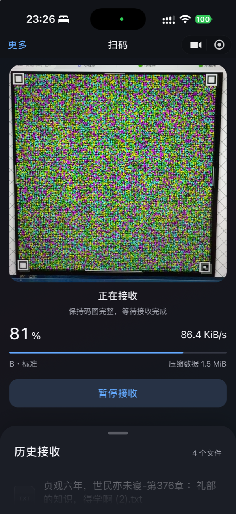
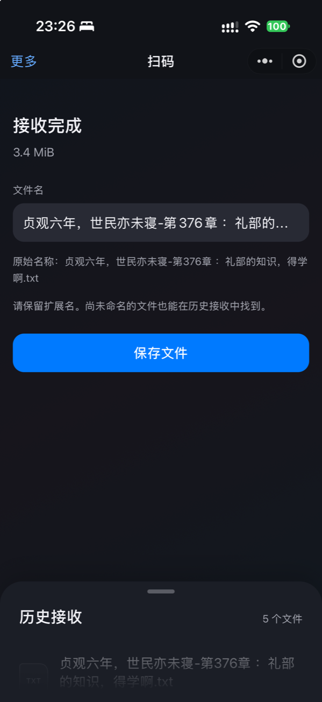
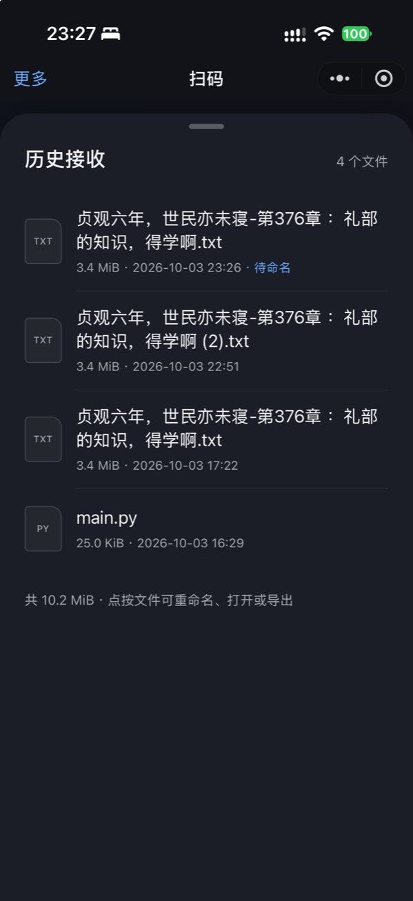
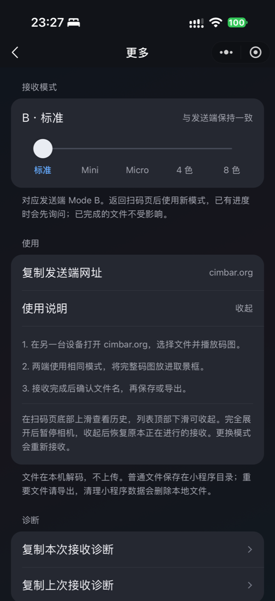

# 微信 CIMBAR 文件接收器

**[English](README.en.md)**

一个只做 **cimbar 解码** 的原生微信小程序，目标平台为 Android 和 iPhone。使用手机相机读取发送端播放的动态码图，在本机完成定位、纠错、文件重组和解压；完成后提示命名，保存到小程序专属目录。全程离线运行，不需要服务端、云开发或上传接口，文件不上传。

解码核心是实际编译进包的 libcimbar WASM，运行时无 npm 依赖。源码与问题反馈：[lejw0925/wechat-libcimbar](https://github.com/lejw0925/wechat-libcimbar)。如果这个工具对你有帮助，欢迎 **Star**（"更多"页面提供复制源码链接，不会自动代用户 Star 或上传文件）。

## 界面预览（iPhone 实测）

| 正在接收 | 接收完成 | 历史接收 | 更多设置 |
| --- | --- | --- | --- |
|  |  |  |  |

iPhone 实测：发送端 cimbar.org、B·标准模式，有效接收速度 86.4 KiB/s，3.4 MiB 文件多次完整接收并保存。

## 扫码使用

小程序已正式上线，微信扫一扫即可使用：


## 直接运行

1. 在微信开发者工具中导入本项目根目录（`project.config.json` 已配置 `miniprogramRoot`），将 `appid` 换成自己的 AppID。游客模式可查看界面；真机预览、权限与隐私流程需要真实 AppID。不要提交 AppSecret 或其他凭据。
2. 选择基础库 **3.7.0 或更新版本**，用当前稳定版微信预览。无需"构建 npm"，无需重新编译 WASM。
3. 在小程序管理后台补充相机相关的用户隐私保护指引；代码会在开始接收时请求隐私授权与 `scope.camera`。
4. 另一台设备打开 [cimbar.org](https://cimbar.org)，选择文件并播放码图。默认 **B·标准 / Mode B**；修改模式点左上角"更多"，滑动选择与发送端一致的档位。
5. 打开小程序直接进入扫码页并请求相机授权。对准完整码图（四个角标都在框内，屏幕与镜头尽量平行），等待还原文件，确认文件名后保存。

首次建议用几十 KiB 的文件、较慢的发送帧率开始；标准模式在低分辨率相机帧上难以识别时，两端同时切到 Mini 或 Micro。

## 功能特点

- **首页即扫码**：启动直接准备相机，方形取景，实时显示进度与有效接收速度（约 3 秒滑动窗口，按去重后的有效载荷计）。
- **五档模式**：标准、Mini、Micro、旧版 4 色、旧版 8 色，记住上次选择；已有进度时切换会先确认，已解码完成待保存的文件不会被丢弃。
- **自适应采样**：8 fps 起步，在 4／8／12／20 fps 间按负载逐级升降档，始终单帧在途、无帧队列；iPhone 优先在 Worker 内直接取帧（跨线程只传尺寸与结果），Android 及兼容路径在投递前居中裁为正方形（720×1280 时跨线程像素量减少 43.75%）。
- **暂停与续收**：切后台暂停、回前台继续当前会话；首次内存警告自动暂停并保留进度且本次限速 4 fps，重复警告才终止会话并明确提示。
- **历史接收**：扫码页底部上滑展开，支持重命名、预览、导出与确认后删除；文件以 256 KiB 分块落盘，完整写入才计入记录，同名自动加序号，带文件名过滤与防路径穿越。
- **外观**：系统字体、蓝色操作色，浅色／深色自动跟随微信；详细界面约定见 [docs/design.md](docs/design.md)。
- **诊断**：更多页可复制本次／上次接收诊断（模式、帧尺寸、档位、耗时、WASM 堆等），仅保留两份本机快照，不含文件内容、不自动上传。

## 文件保存在哪里

持久化位置为 `wx.env.USER_DATA_PATH/cimbar-received/`，即小程序专属目录，跨页面、跨重启可读。手机端微信没有"写入任意系统目录"的通用接口，出口如下：

| 文件／平台 | 出口 |
| --- | --- |
| Android / iPhone 普通文件 | 小程序本地保存；可主动"转发文件到微信聊天" |
| JPG / PNG 图片、MP4 视频 | 额外支持"保存到手机相册"（需权限与有效格式） |
| 微信支持的文档 | `openDocument` 预览 |
| 电脑端已有文件 | 支持时可用 `saveFileToDisk` |

清理小程序数据或删除记录会删除对应本地文件，重要文件请导出。

## 工作原理

相机 RGBA → 居中正方形裁剪 → 定位／透视校正 → 符号与颜色解码 → Reed–Solomon 纠错 → Wirehair 去重与重组 → Zstandard 解压 → 分块落盘 → 用户命名。

解码算法来自 [libcimbar](https://github.com/sz3/libcimbar)，相机接收流程参考 [CFC](https://github.com/sz3/cfc)。WASM 经 `WXWebAssembly.instantiate` 在 Worker 中运行，不依赖 DOM、fetch、`TextDecoder` 或浏览器计时 API，未使用 SIMD 或共享内存。每次接收一个文件；压缩数据上限 16 MiB、解压后上限 64 MiB、WASM 内存上限 256 MiB——这些是拒绝超限输入的边界，不代表手机一定能接收此大小的文件。协议本身不提供发送者身份认证与文件端到端签名。

## 相机与速度口径

微信只提供 `small / medium / large` 期望帧尺寸，实际像素由系统决定：回调 720×1280 时取中央 720×720 解码，1080×1920 时取 1080×1080，不会放大像素冒充更高分辨率（诊断中可查看原始与解码尺寸）。"有效接收速度"统计去重后的有效 fountain 载荷，不含相机像素、重复包与纠错开销，不是 Wi-Fi 速度，也不等于文件大小除以时间。与 CFC 安卓端的性能调查、基准与对比口径见 [docs/performance.md](docs/performance.md)。

## 从源码重建

已验证构建环境：Node.js 22、CMake 4、Emscripten 6.0.9，macOS arm64。Node.js 最低要求 22.15（完整测试使用 Node 的 Zstd 接口）。源码重建还需要 Git、C/C++ 构建工具，以及首次下载依赖的网络连接。

```sh
npm run build:wasm
npm run check
npm test
npm run test:wasm
npm run test:memory
```

`build:wasm` 自动获取并验证以下固定版本，构建 OpenCV 的 core/imgproc 和解码依赖，生成 JS、Brotli WASM、构建哈希与许可证。已有 checkout 的版本不符时会停止，不会覆盖你的源码。

- libcimbar：`bfb0c8e471820ae493cd3694ea6bed5d5ac06c37`
- OpenCV 4.11.0：`31b0eeea0b44b370fd0712312df4214d4ae1b158`
- CFC 参考版本：`e143ebd16154f3db17fbfdf8d0da71b1b50678a4`

Emscripten 缓存位于 `.cache/emscripten/`，构建输出位于 `build/`。可用 `CIMBAR_JOBS=4` 调整并发。测试专用编码器只在 `build/decoder/` 中，**不进入小程序代码包**。

若要额外运行官方 PNG 样本回归，安装 FFmpeg，并获取上游样本：

```sh
git -C third_party/libcimbar submodule update --init samples
npm run test:wasm
```

## 验证状态

桌面已验证：真实 WASM 加载与官方 Mode B 样本还原（7,538 字节）；官方样本合成的 720×1280 相机帧裁剪后完整恢复；上游四张真实拍摄 JPG 均成功定位解码；五种模式 60,000 字节往返测试（丢帧、乱序、重复）SHA-256 与原始数据一致；1 MiB 难压缩数据长时间测试 WASM 堆保持 32 MiB；97 项 Node 测试与 18 组浏览器布局检查通过。

真机：iPhone 已多次完整接收 3.4 MiB 文件（有效速度 86.4 KiB/s，含命名、保存与历史记录，见上方截图）；Android 已实测可正确接收文件，速率约 50 KB/s。原生鸿蒙（HarmonyOS NEXT）尚未测试。双端验收步骤见 [docs/device-testing.md](docs/device-testing.md)。小程序已正式上线。

## 开源许可

本项目自有源码采用 [Mozilla Public License 2.0](LICENSE)。第三方组件保留各自的许可及版权声明，详见 [THIRD_PARTY_NOTICES.md](THIRD_PARTY_NOTICES.md) 和随包许可全文；编译产物的对应源码、固定依赖版本与重建脚本均可从本仓库获取。
